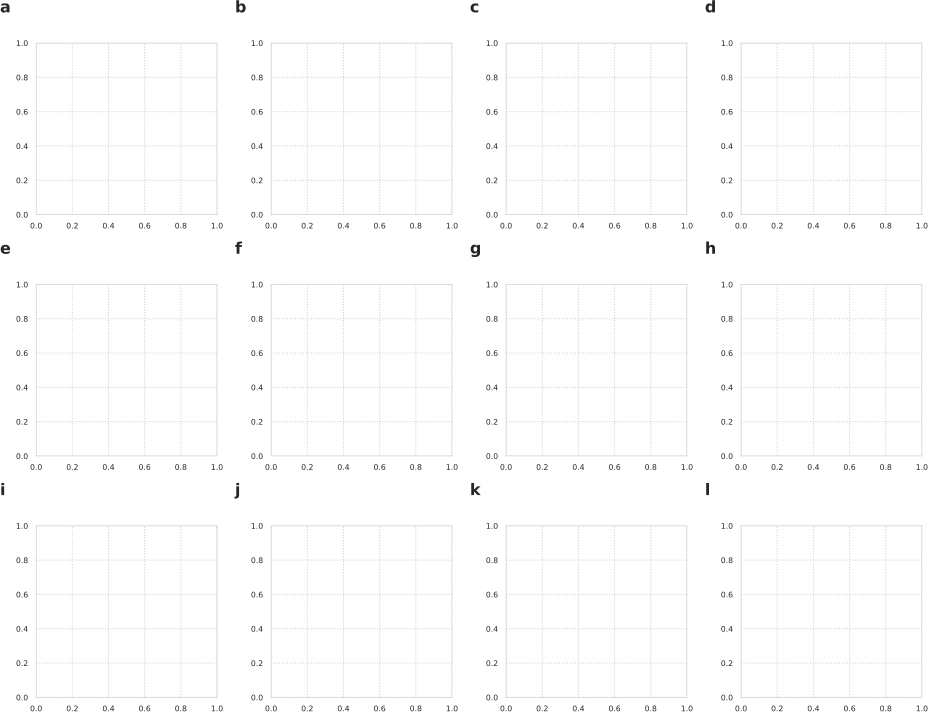
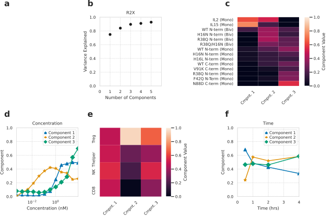
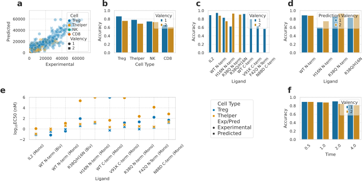
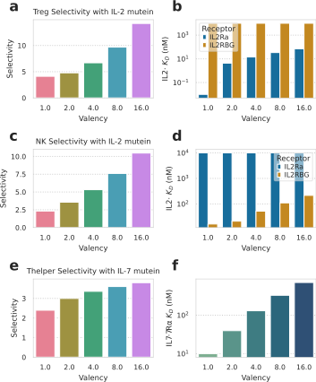

---
title: Multivalency enhances the specificity of Fc-cytokine fusions
keywords:
- cytokines
- IL-2
lang: en-US
date-meta: '2021-03-10'
author-meta:
- Brian Orcutt-Jahns
- Peter C. Emmel
- Zoe S. Kim
- Scott M. Carlson
- Aaron S. Meyer
header-includes: |-
  <!--
  Manubot generated metadata rendered from header-includes-template.html.
  Suggest improvements at https://github.com/manubot/manubot/blob/master/manubot/process/header-includes-template.html
  -->
  <meta name="dc.format" content="text/html" />
  <meta name="dc.title" content="Multivalency enhances the specificity of Fc-cytokine fusions" />
  <meta name="citation_title" content="Multivalency enhances the specificity of Fc-cytokine fusions" />
  <meta property="og:title" content="Multivalency enhances the specificity of Fc-cytokine fusions" />
  <meta property="twitter:title" content="Multivalency enhances the specificity of Fc-cytokine fusions" />
  <meta name="dc.date" content="2021-03-10" />
  <meta name="citation_publication_date" content="2021-03-10" />
  <meta name="dc.language" content="en-US" />
  <meta name="citation_language" content="en-US" />
  <meta name="dc.relation.ispartof" content="Manubot" />
  <meta name="dc.publisher" content="Manubot" />
  <meta name="citation_journal_title" content="Manubot" />
  <meta name="citation_technical_report_institution" content="Manubot" />
  <meta name="citation_author" content="Brian Orcutt-Jahns" />
  <meta name="citation_author_institution" content="Department of Bioengineering, University of California, Los Angeles" />
  <meta name="citation_author" content="Peter C. Emmel" />
  <meta name="citation_author_institution" content="Department of Bioengineering, University of California, Los Angeles" />
  <meta name="citation_author" content="Zoe S. Kim" />
  <meta name="citation_author_institution" content="Department of Bioengineering, University of California, Los Angeles" />
  <meta name="citation_author" content="Scott M. Carlson" />
  <meta name="citation_author_institution" content="Visterra, Inc." />
  <meta name="citation_author" content="Aaron S. Meyer" />
  <meta name="citation_author_institution" content="Department of Bioengineering, University of California, Los Angeles" />
  <meta name="citation_author_institution" content="Department of Bioinformatics, University of California, Los Angeles" />
  <meta name="citation_author_institution" content="Jonsson Comprehensive Cancer Center, University of California, Los Angeles" />
  <meta name="citation_author_institution" content="Eli and Edythe Broad Center of Regenerative Medicine and Stem Cell Research, University of California, Los Angeles" />
  <meta name="citation_author_orcid" content="0000-0003-4513-1840" />
  <meta name="twitter:creator" content="@aarmey" />
  <link rel="canonical" href="https://meyer-lab.github.io/type-I-ckine-model/" />
  <meta property="og:url" content="https://meyer-lab.github.io/type-I-ckine-model/" />
  <meta property="twitter:url" content="https://meyer-lab.github.io/type-I-ckine-model/" />
  <meta name="citation_fulltext_html_url" content="https://meyer-lab.github.io/type-I-ckine-model/" />
  <meta name="citation_pdf_url" content="https://meyer-lab.github.io/type-I-ckine-model/manuscript.pdf" />
  <link rel="alternate" type="application/pdf" href="https://meyer-lab.github.io/type-I-ckine-model/manuscript.pdf" />
  <link rel="alternate" type="text/html" href="https://meyer-lab.github.io/type-I-ckine-model/v/e481bc03f89ae5f4721f085f2771b8425662cdd4/" />
  <meta name="manubot_html_url_versioned" content="https://meyer-lab.github.io/type-I-ckine-model/v/e481bc03f89ae5f4721f085f2771b8425662cdd4/" />
  <meta name="manubot_pdf_url_versioned" content="https://meyer-lab.github.io/type-I-ckine-model/v/e481bc03f89ae5f4721f085f2771b8425662cdd4/manuscript.pdf" />
  <meta property="og:type" content="article" />
  <meta property="twitter:card" content="summary_large_image" />
  <link rel="icon" type="image/png" sizes="192x192" href="https://manubot.org/favicon-192x192.png" />
  <link rel="mask-icon" href="https://manubot.org/safari-pinned-tab.svg" color="#ad1457" />
  <meta name="theme-color" content="#ad1457" />
  <!-- end Manubot generated metadata -->
bibliography: []
manubot-output-bibliography: output/references.json
manubot-output-citekeys: output/citations.tsv
manubot-requests-cache-path: cache/requests-cache
manubot-clear-requests-cache: false
...

<small><em>
This manuscript
([permalink](https://meyer-lab.github.io/type-I-ckine-model/v/e481bc03f89ae5f4721f085f2771b8425662cdd4/))
was automatically generated
from [meyer-lab/type-I-ckine-model@e481bc0](https://github.com/meyer-lab/type-I-ckine-model/tree/e481bc03f89ae5f4721f085f2771b8425662cdd4)
on March 10, 2021.
</em></small>

## Authors

+ **Brian Orcutt-Jahns** 
    · Github
    [borcuttjahns](https://github.com/borcuttjahns) 
  <small>
     Department of Bioengineering, University of California, Los Angeles
  </small>

+ **Peter C. Emmel** 
    · Github
    [petercemmel](https://github.com/petercemmel) 
  <small>
     Department of Bioengineering, University of California, Los Angeles
  </small>

+ **Zoe S. Kim** 
    · Github
    [zoeskim](https://github.com/zoeskim) 
  <small>
     Department of Bioengineering, University of California, Los Angeles
  </small>

+ **Scott M. Carlson**  
  <small>
     Visterra, Inc.
  </small>

+ **Aaron S. Meyer** 
    ORCID
    [0000-0003-4513-1840](https://orcid.org/0000-0003-4513-1840)
    · Github
    [aarmey](https://github.com/aarmey)
    · twitter
    [aarmey](https://twitter.com/aarmey) 
  <small>
     Department of Bioengineering, University of California, Los Angeles; Department of Bioinformatics, University of California, Los Angeles; Jonsson Comprehensive Cancer Center, University of California, Los Angeles; Eli and Edythe Broad Center of Regenerative Medicine and Stem Cell Research, University of California, Los Angeles
  </small>

## Abstract {.page_break_before}

The cytokines that interact with the common γ-chain cytokine receptor, including interleukin (IL)-2, IL-4, IL-7, IL-9, IL-15, and IL-21, have existing uses and future promise as immunotherapeutic agents. The therapeutic potential of these ligands is most often limited not by their potency, but by insufficient selectivity in the face of considerable off-target toxicities. These potentials and limitations have inspired a variety of engineering approaches, including mutein ligands with altered receptor binding kinetics and Fc-fused molecules for improved pharmacokinetics, sometimes with surprising potency or off-target effects. Here, we aim to systematically profile the signaling response to a wide variety of wild-type and mutein IL-2 molecules in various Fc-fusion configurations. Using data-driven and mechanistic analysis to explore the sources of signaling specificity, we determine that the vast majority of signaling specificity can be explained using a simple model of multivalent receptor binding. More specifically, bivalent Fc-fusions display enhanced specificity and potency for regulatory T cells through avidity effects toward IL-2Rα, and this enhancement is distinct from what can be acheived by mutein affinity changes. We propose that variation in the valency of therapeutic cytokine interventions is an unexplored axis for optimizing the potency and toxicity of these agents.

## Summary points

- IL-2 receptor abundance and responses are highly heterogeneous
- Both receptor and response measurements can be treated as samples from a multivariate distribution
- Propagation of moments enables prediction and fitting between diverse models and single cell measurements
- Variation in each IL-2 receptor produces distinct patterns of cell-to-cell heterogeneity
- Fitting the variation in response can refine cell signaling models

## Introduction

The cytokines binding the common γ-chain (γ~c~) receptor, including interleukin (IL)-2, 4, 7, 9, 15, and 21, are a critical hub in modulating both innate and adaptive immune responses [@DOI:10.1016/j.immuni.2019.03.028]. The cytokine family operates through a common theme of binding private receptors for each ligand, before engaging the common γ~c~ receptor to induce signaling. A prominent phenotypic outcome of γ~c~ receptor signaling is lymphoproliferation, and so the cytokines are often observed to be an endogenous or exogenous mechanism for altering the balance of immune cell types. This phenotype is observed most extremely from loss-of-function or reduced activity mutations in gc which subvert T and NK cell maturation. Disruptive mutations in private receptors can lead to more selective reductions in cell types such as regulatory T cells (T~reg~s) with IL-2Rα or T cells with IL-7Rα. Conversely, activating mutations in these receptors, such as IL-7Rα promote cancers such as B and T cell leukemias.

Understanding the signaling processes involved.

The importance of these cytokines to immune homeostasis, alongside challenges in altering their signaling toward specific therapeutic goals, has inspired a variety of engineered forms. Perhaps the most common approach has been to alter the receptor affinities of IL-2 to weaken its interaction with IL-2Rα, IL-2Rβ, or both receptors. IL-2Rα confers T~reg~s with greater sensitivity toward IL-2, and so IL-2Rα affinity tunes the relative amount of signaling toward regulatory versus effector populations, while IL-2Rβ modulates the overall signaling potency [@PMID:25992859]. In most cases the wild-type cytokine or mutein is fused to an IgG antibody to take advantage of FcRn recycling for extended half-life. The antibody has also been employed in a more active role by binding to IL-2 to influence its availability to each receptor in so-called immunocytokine [@PMID:25992858]. Fc fusion has taken a variety of forms, including orienting the cytokine in an N-terminal or C-terminal orientation, including one or two cytokines per IgG, and including or excluding Fc effector functions [@DOI:10.1101/778894]. Notably, bivalent cytokine fusion has been noted to be more potent in T~reg~-targeted engineered therapies, perhaps through pharmacokinetic or other means [@DOI:10.1126/sciimmunol.aba5264]. As a result, the potential design space for these molecules quickly becomes intractable for experimental exploration without consistent design principals.

Here, we systematically and comprehensively evaluate the signaling specificity effects of engineered cytokine alterations, including affinity-altering mutations and Fc-fusion formats. We explore three hypotheses for the widely observed effect that Fc-fusion in a bivalent format enhances potency _in vivo_. We find that this can be fully explained by the effect multivalency has on binding selectivity toward cells with higher receptor abundance. The signaling specificity of all muteins and Fc-formats match well with a multivalent binding model, both between cell types and across cell-to-cell variation within a cell type. Finally, we argue that cytokine valency is an unexplored axis of further enhancing selective signaling responses, and that many opportunities for using multivalency exist within the γ~c~ cytokine family.

## Results

### Variation in receptor abundance drives variation in response

{#fig:C1}

### Comprehensive molecular response profiling

{#fig:C2}

### Bivalent Fc-cytokine fusions have distinct cell specificity but not dynamics

Exploring how dynamic responses vary across responding cell types and ligand treatments is challenging due to the multi-dimensional contributions to differences in response. Restricting ones' view to a single time point, cell type, or ligand concentration provides only a slice of the picture [@DOI:10.1101/778894; @DOI:10.1101/2021.01.03.425138]. Therefore, we applied tensor factorization as a way to separate the contribution of each dimension in overall response.

We arranged our profiling experiments into a four-dimensional tensor, with each dimension varying the ligand used, treatment concentration, treatment duration, or cell type used in the profiling. We then factored this data using non-negative, canonical polyadic decomposition to derive factors summarizing the influence of each dimension. Three components explained roughly 90% of the variance within the dataset.

As we have seen before [@DOI:10.1101/778894], tensor factorization clearly separated the contribution of each dimension into each factor, and distinct responses into separate components. Component 1 almost exclusively represented responses in the cytokines that were not Fc-conjugated (Fig. [@fig:tfac]c) at high concentrations (Fig. [@fig:tfac]d). Its response was not cell specific across the four cell populations (Fig. [@fig:tfac]e) and relatively transient (Fig. [@fig:tfac]f). Interestingly, the remaining two components partly separated by whether cytokines were Fc-fused in a monovalent or bivalent form (Fig. [@fig:tfac]c), with the bivalent cytokines weighted more strongly by component 2, and the monovalent forms on component 3. Component 2 explained responses almost exclusive to regulatory T cells (Fig. [@fig:tfac]e) at lower concentrations (Fig. [@fig:tfac]d), while component 3 had a broad response (Fig. [@fig:tfac]e) and increased with concentration (Fig. [@fig:tfac]d). Despite these strong differences in specificities, and a difference in the timing for an initial response, both components were similarly sustained on longer timescales (Fig. [@fig:tfac]f).

{#fig:tfac}

### Difference in cell response is explained by a simple, multivalent binding model

{#fig:C4}

### Multivalent binding model also captures cell-to-cell variability

{#fig:C5}

### Multivalency provides a general strategy for enhanced binding selectivity

{#fig:C6}

## Discussion

## Materials and Methods

All analysis was implemented in Python, and can be found at <https://github.com/meyer-lab/type-I-ckine-model>, release 1.0.

### Modeling

#### Binding model

When complexes are engineered and ligands are not randomly sorted into multivalent complexes, such as with the Fabs of bispecific antibodies, the proportions of each kind of complex become exogenous variables and are no longer decided by the monomer composition $C_i$'s. The monomer composition of a ligand complex can be represented by a vector $\mathbf{θ} = (θ_1, θ_2, ..., θ_{N_L})$, where each $θ_i$ is the number of monomer ligand type $i$ on that complex. Let $C_{\mathbf{θ}}$ be the proportion of the $\mathbf{θ}$ complexes in all ligand complexes, and $Θ$ be the set of all possible $\mathbf{θ}$'s. We have $\sum_{\mathbf{θ} \in Θ} C_{\mathbf{θ}} = 1$.

The binding between a ligand complex and a cell expressing several types of receptors can still be represented by a series of $q_{ij}$. The relationship between $q_{ij}$'s and $θ_i$ is given by $θ_i = q_{i0} + q_{i1} + ... + q_{iN_R}$. Let the vector $\mathbf{q}_i = (q_{i0}, q_{i1}, ..., q_{iN_R})$, and the corresponding $\mathbf{θ}$ of a binding configuration $\mathbf{q}$ be $\mathbf{θ}(\mathbf{q})$. For all $i$ in $\{1,2,...,N_L\}$, we define $ψ_{ij} = R_{\mathrm{eq},j} K_{a,ij} K_x^*$ where $j = \{1,2,...,N_R\}$ and $ψ_{i0} = 1$. The relative amount of complexes bound to a cell with configuration $\mathbf{q}$ at equilibrium is

$$v_{\mathbf{q},eq} = \frac{L_0 C_{\mathbf{θ}(\mathbf{q})}}{K_x^* }
\prod_{i=1\\j=0}^{i=N_L\\ j=N_R} {ψ_{ij}}^{q_{ij}}
\prod_{i=1}^{N_L} \binom{θ_i}{\mathbf{q}_i} .$$

Then we can calculate the relative amount of bound receptor $n$ as

$$
R_{\mathrm{bound},n} = \frac{L_0}{K_x^* } \sum_{\mathbf{θ} \in Θ} C_{\mathbf{θ}}
\left[ \sum_{i=1}^{N_L} \frac{ψ_{in} θ_i}{\sum_{j=0}^{N_R} ψ_{ij}} \right]
\prod_{i=1}^{N_L} \left( \sum_{j=0}^{N_R} ψ_{ij}\right)^{θ_i} .
$$

By $R_{\mathrm{tot},n} = R_{\mathrm{eq},n} + R_{\mathrm{bound},n}$, we can solve $R_{\mathrm{eq},n}$ numerically for each type of receptor. The total relative amount of ligand binding at equilibrium is

$$ L_{\mathrm{bound}} =  \frac{L_0}{K_x^* } \sum_{\mathbf{θ} \in Θ} C_{\mathbf{θ}}
\left[ \prod_{i=1}^{N_L} \left( \sum_{j=0}^{N_R} ψ_{ij}\right)^{θ_i} -1 \right] .$$

#### Tensor Factorization

Before decomposition, the tensor was variance scaled across each cell population. Tensor decomposition was performed using the Python package TensorLy [@TensorlyArxiv], using non-negative canonical polyadic decomposition.

### Experimental Methods

#### Receptor abundance quantitation

Cryopreserved PBMCs (ATCC, PCS-800-011, lot#81115172) were thawed to room temperature and slowly diluted with 9 mL pre-warmed RPMI-1640 medium (Gibco, 11875-093) supplemented with 10% fetal bovine serum (FBS, Seradigm, 1500-500, lot#322B15). Media was removed, and cells washed once more with 10 mL warm RPMI-1640 + 10% FBS. Cells were brought to 1.5x10^6^ cells/mL, distributed at 250,000 cells per well in a 96-well V-bottom plate, and allowed to recover 2 hrs at 37℃ in an incubator at 5% CO2. Cells were then washed twice with PBS + 0.1% BSA (PBSA, Gibco, 15260-037, Lot#2000843) and suspended in 50 µL PBSA + 10% FBS for 10 min on ice to reduce background binding to IgG.

Antibodies were diluted in PBSA + 10% FBS and cells were stained for 1 hr at 4℃ in darkness with a gating panel (Panel 1, Panel 2, Panel 3, or Panel 4) and one anti-receptor antibody, or an equal concentration of matched isotype/fluorochrome control antibody. Stain for CD25 was included in Panel 1 when CD122, CD132, CD127, or CD215 was being measured (CD25 is used to separate T~reg~s from other CD4+ T cells).

Compensation beads (Simply Cellular Compensation Standard, Bangs Labs, 550, lot#12970) and quantitation standards (Quantum Simply Cellular anti-Mouse IgG or anti-Rat IgG, Bangs Labs, 815, Lot#13895, 817, Lot#13294) were prepared for compensation and standard curve. One well was prepared for each fluorophore with 2 µL antibody in 50 µL PBSA and the corresponding beads. Bead standards were incubated for 1 hr at room temperature in the dark.

Both beads and cells were washed twice with PBSA. Cells were suspended in 120 µL per well PBSA, and beads to 50 µL, and analyzed using an IntelliCyt iQue Screener PLUS with VBR configuration (Sartorius) with a sip time of 35 and 30 secs for cells and beads, respectively. Antibody number was calculated from fluorescence intensity by subtracting isotype control values from matched receptor stains and calibrated using the two lowest binding quantitation standards. T~reg~ cells could not be gated in the absence of CD25, so CD4+ T cells were used as the isotype control to measure CD25 in T~reg~ populations. Cells were gated as shown in XXX. Measurements were performed using four independent staining procedures over two days. Separately, the analysis was performed with anti-receptor antibodies at 3x normal concentration to verify that receptor binding was saturated. Replicates were summarized by geometric mean.

#### pSTAT5 Measurement of IL-2 and -15 Signaling in PBMCs

Human PBMCs were thawed, distributed across a 96-well plate, and allowed to recover as described above. IL-2 (R&D Systems, 202-IL-010) or IL-15 (R&D Systems, 247-ILB-025) were diluted in RPMI-1640 without FBS and added to the indicated concentrations. To measure pSTAT5, media was removed, and cells fixed in 100 µL of 10% formalin (Fisher Scientific, SF100-4) for 15 mins at room temperature. Formalin was removed, cells were placed on ice, and cells were gently suspended in 50 µL of cold methanol (-30℃). Cells were stored overnight at -30℃. Cells were then washed twice with PBSA, split into two identical plates, and stained 1 hr at room temperature in darkness using antibody panels 4 and 5 with 50 µL per well. Cells were suspended in 100 µL PBSA per well, and beads to 50 µL, and analyzed on an IntelliCyt iQue Screener PLUS with VBR configuration (Sartorius) using a sip time of 35 seconds and beads 30 seconds. Compensation was performed as above. Populations were gated as shown in XXX, and the median pSTAT5 level extracted for each population in each well.

#### Recombinant proteins

IL-2/Fc fusion proteins were expressed using the Expi293 expression system according to manufacturer instructions (Thermo Scientific). Proteins were as human IgG1 Fc fused at the N- or C-terminus to human IL-2 through a (G4S)4 linker. C-terminal fusions omitted the C-terminal lysine residue of human IgG1. The AviTag sequence GLNDIFEAQKIEWHE was included on whichever terminus did not contain IL-2. Fc mutations to prevent dimerization were introduced into the Fc sequence [@doi:10.1074/jbc.M113.457689]. Proteins were purified using MabSelect resin (GE Healthcare). Proteins were biotinylated using BirA enzyme (BPS Biosciences) according to manufacturer instructions, and extensively buffer-exchanged into phosphate buffered saline (PBS) using Amicon 10 kDa spin concentrators (EMD Millipore). The sequence of IL-2Rβ/γ Fc heterodimer was based on a reported active heterodimeric molecule (patent application US20150218260A1), with the addition of (G4S)2 linker between the Fc and each receptor ectodomain. The protein was expressed in the Expi293 system and purified on MabSelect resin as above. IL2-Rα ectodomain was produced with C-terminal 6xHis tag and purified on Nickel-NTA spin columns (Qiagen) according to manufacturer instructions. 

#### Octet binding assays

Binding affinity was measured on an OctetRED384 (ForteBio). Briefly, biotinylated monomeric IL-2/Fc fusion proteins were uniformly loaded to Streptavidin biosensors (ForteBio) at roughly 10% of saturation point and equilibrated for 10 minutes in PBS + 0.1% bovine serum albumin (BSA). Association time was up to 40 minutes in IL-2Rβ/γ titrated in 2x steps from 400 nM to 6.25 nM, or IL-2Rα from 25 nM to 20 pM, followed by dissociation in PBS + 0.1% BSA. A zero-concentration control sensor was included in each measurement and used as a reference signal. Assays were performed in quadruplicate across two days. Binding to IL-2Rα did not fit to a simple binding model so equilibrium binding was used to determine the K~D~ within each assay. Binding to IL-2Rβ/γ fit a 1:1 binding model so on-rate (k~on~), off-rate (k~off~) and K~D~ were determined by fitting to the entire binding curve. Kinetic parameters and K~D~ were calculated for each assay by averaging all concentrations with detectable binding signal (typically 12.5 nM and above).

## Acknowledgements

This work was supported by a research agreement with Visterra, Inc. **Competing financial interests:** S.M.C. and C.P. are employees of Visterra Inc.

## Author contributions statement

A.S.M. and S.M.C. conceived of the study. S.M.C. and C.P. performed the PBMC experiments and engineered the IL-2 fusion proteins. A.S.M, B.O.J., and Z.S.K. performed the computational analysis. All authors helped to design experiments and/or analyze the data.

## Author contributions statement

A.S.M. and S.M.C. conceived of the study. A.S.M, B.O.J., P.C.E., and Z.S.K. performed the computational analysis. All authors helped to design experiments and/or analyze the data.

## References {.page_break_before}

<!-- Explicitly insert bibliography here -->

